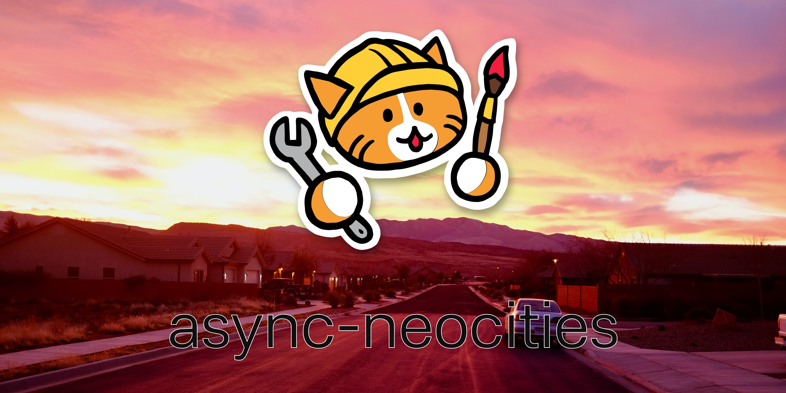

# async-neocities
[](https://github.com/bcomnes/async-neocities/actions)
[](https://github.com/voxpelli/types-in-js)

An api client for [neocities][nc] with an async/promise API and an efficient content-aware diff algorithm.
Now including full type support!

<center></center>

Also available as a Github Action: [deploy-to-neocities](https://github.com/marketplace/actions/deploy-to-neocities)

```console
npm install async-neocities
```

## Usage

``` js
import path from 'node:path'
import { NeocitiesAPIClient } from 'async-neocities'

const apiKeyResponse = await NeocitiesAPIClient.getKey({
  siteName: 'siteName',
  ownerPassword: 'password'
})

const client = new NeocitiesAPIClient(apiKeyResponse.api_key)

console.log(await client.list()) // site files
console.log(await client.info()) // site info

await client.deploy({
  directory: path.join(import.meta.dirname, './site-contents'),
  cleanup: true, // Delete orphaned files
  includeUnsupportedFiles: true // Upload unsupported files. Paid neocities feature
})
```

## Bin

`async-neocities` ships a bin that lets you deploy to neocities locally or in CI.

It's interactive and will help you set up your config and keys.

The site name is configured to a file in cwd called `deploy-to-neocities.json` that looks like:

```json
{"siteName":"the-name-of-the-site"}
```

```console
Usage: async-neocities [options]

    Example: async-neocities --src public

    --help, -h            print help text
    --src, -s             The directory to deploy to neocities (default: "public")
    --cleanup, -c         Destructively clean up orphaned files on neocities
    --protect, -p         String to minimatch files which will never be cleaned up
    --supporter, -S       Neocities Supporter mode: bypass file type restrictions
    --status              Print auth status of current working directory
    --print-key           Print api-key status of current working directory
    --clear-key           Remove the currently associated API key
    --force-auth          Force re-authorization of current working directory
    --preview, -P         Preview the files that will be uploaded

async-neocities (v3.0.7)
```

You can set the flags with ENV vars

- `ASYNC_NEOCITIES_API_KEY` or `NEOCITIES_API_TOKEN`: the API token matching the site name, but you should set and commit the `deploy-to-neocities.json` file.
- `ASYNC_NEOCITIES_SITE_NAME`: the name of the site to deploy to.

## API

### `import { NeocitiesAPIClient } from 'async-neocities'`

Import the Neocities API client.

### `{ result, api_key } = await NeocitiesAPIClient.getKey({ siteName, ownerPassword })`

Static class method that will get an API Key from a `siteName` and `ownerPassword`.

### `client = new NeocitiesAPIClient(apiKey)`

Create a new API client for a given API key.

All API methods return data from a successful request.
Any bad responses will throw an error.
Anything else that goes wrong will throw an error.
If you call any methods from a client instance, be sure to handle the errors!

### `uploadResult = await client.upload(files)`

Pass an array of objects with the `{ name, path }` pair to upload these files to neocities, where `name` is desired remote unix path on neocities and `path` is the local path on disk in whichever format the local operating system desires.

Returns a `UploadResults` result:

```js
{
   errors: [],
   results: [
     {
       type: 'uploadResult',
       body: {
          result: 'success',
          message: 'files have been uploaded'
        },
       },
       files: [
         name: 'index.html',
         path: '/path/to/index.html'
        ]
     }
   ]
}
```

### `deleteResults = await client.delete(files)`

Pass an array of path strings to delete on neocities.  The path strings should be the unix style path of the file you want to delete.

A successful `deleteResult`:

```js
{
   type: "deleteResult",
   body: {
     result: 'success',
     message: 'file(s) have been deleted'
   },
    files: [
      '/path/to/index.html'
    ]
}
```

### `siteFileList = await client.list([path])`

Get a list of files for your site.  The optional `path` argument can be used to list files only at a given path of the website.

Example `siteFileList`:

```json
{
  "result": "success",
  "files": [
    {
      "path": "index.html",
      "is_directory": false,
      "size": 1023,
      "updated_at": "Sat, 13 Feb 2016 03:04:00 -0000",
      "sha1_hash": "c8aac06f343c962a24a7eb111aad739ff48b7fb1"
    },
    {
      "path": "not_found.html",
      "is_directory": false,
      "size": 271,
      "updated_at": "Sat, 13 Feb 2016 03:04:00 -0000",
      "sha1_hash": "cfdf0bda2557c322be78302da23c32fec72ffc0b"
    },
    {
      "path": "images",
      "is_directory": true,
      "updated_at": "Sat, 13 Feb 2016 03:04:00 -0000"
    },
    {
      "path": "images/cat.png",
      "is_directory": false,
      "size": 16793,
      "updated_at": "Sat, 13 Feb 2016 03:04:00 -0000",
      "sha1_hash": "41fe08fc0dd44e79f799d03ece903e62be25dc7d"
    }
  ]
}
```

With the `path` argument:

```json
{
  "result": "success",
  "files": [
    {
      "path": "images/cat.png",
      "is_directory": false,
      "size": 16793,
      "updated_at": "Sat, 13 Feb 2016 03:04:00 -0000",
      "sha1_hash": "41fe08fc0dd44e79f799d03ece903e62be25dc7d"
    }
  ]
}
```

### `siteInfo = await client.info([siteName])`

Get info about your or other sites.
The optional `siteName` argument can be used to request unauthenticated info about any neocities website.
When `siteName` is omitted, the authenticated site's info is returned.

Example `siteInfo`:

```json
{
  "result": "success",
  "info": {
    "sitename": "youpi",
    "hits": 5072,
    "created_at": "Sat, 29 Jun 2013 10:11:38 +0000",
    "last_updated": "Tue, 23 Jul 2013 20:04:03 +0000",
    "domain": null,
    "tags": []
  }
}
```

### `deployResult = await client.deploy({ directory, [cleanup], [includeUnsupportedFiles], [protectedFileFilter] })`

Efficiently deploy a `directory` path to Neocities, only uploading missing and changed files.  Files are determined to be different by size, and sha1 hash, if the size is the same.

Other options include:

```js
{
  cleanup: false, // delete orphaned files on neocities that are not in the `directory`
  protectedFileFilter: path => false, // a function that is passed neocities file paths.  When it returns true, that path will never be cleaned up when cleanup is set to true.
  includeUnsupportedFiles: false // include files that are not supported by neocities in the upload. This is a paid neocities supporter feature.
  uploadSort: (a: FileUpload, b: FileUpload) => number // A custom sort function for the files to upload.
}
```

`deployResult` is a complex type that includes a results summary, error summary and diff summary. Please check the types on this one.

### `diff = await client.previewDeploy({ directory, [includeUnsupportedFiles], [protectedFileFilter] })`

Preview a deploy from a `directory` path to Neocities. Returns the diff summary without modifying anything.

Other options include:

`diff` is a complex type that includes a diff summary. Please check the types on this one.

## See also

- [Neocities API docs](https://neocities.org/api)
- [Official Node.js API client](https://github.com/neocities/neocities-node)
- [bcomnes/deploy-to-neocities](https://github.com/bcomnes/deploy-to-neocities) This module as an action.

## License

MIT

[querystring]: https://nodejs.org/api/querystring.html
[nf]: https://ghub.io/node-fetch
[fd]: https://ghub.io/form-data
[nc]: https://neocities.org
